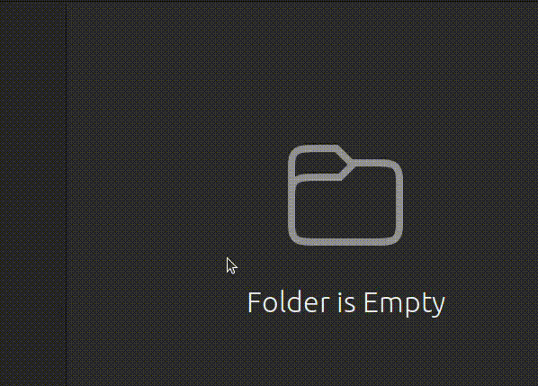
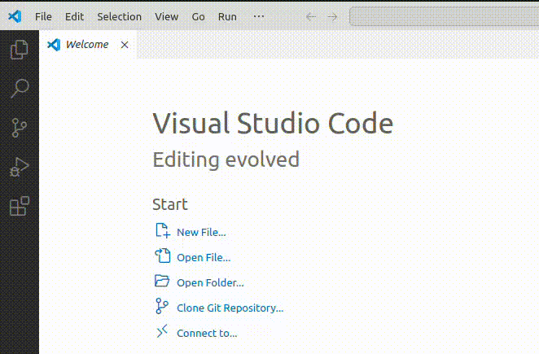
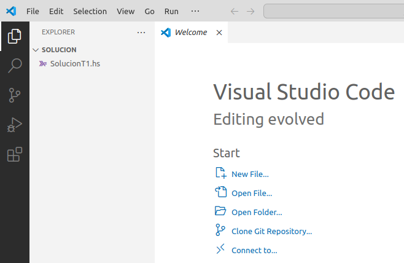
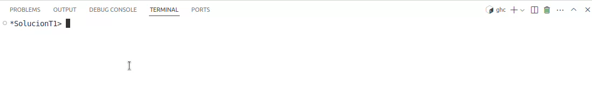
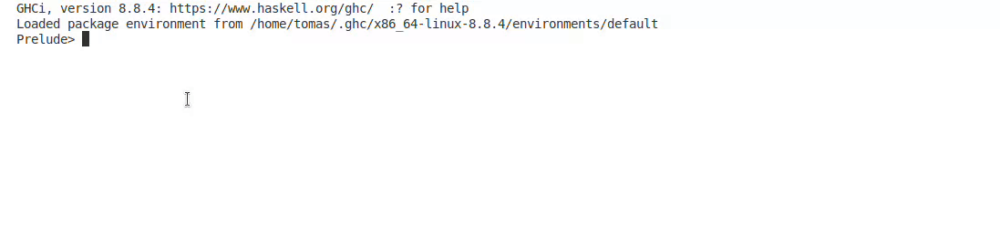
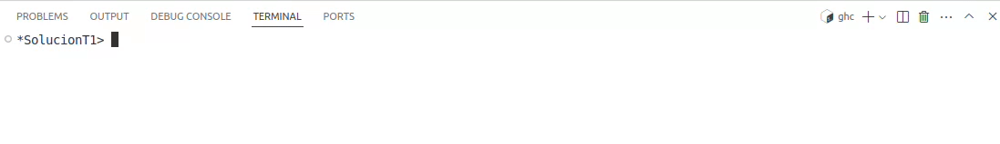
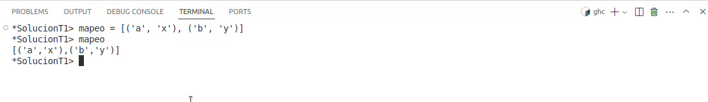
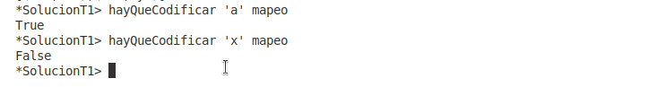

# Tips para el parcial
## Definir una carpeta de trabajo
1. Crear una carpeta de trabajo y colocar la plantilla (template) dentro:

    

1. Ingresar a VSCode y abrir la carpeta desde `File -> Open folder...`. Esto es práctico para asegurarse que la terminal ya esté iniciada en esa carpeta.

    

    Esto abrirá una nueva ventana de _VSCode_ sobre la carpeta elegida:

     
    
    **Al abrir la terminal van a observar que ya está "posicionada" sobre la carpeta seleccionada.**

## Manejo de GHCI
- Dentro de GHCI, si la ejecución se cuelga presionar `CTRL + C` para detener la ejecución.

    

- GHCI tiene autocompletado desde la terminal. Esto es útil para no tener que escribir el nombre completo de una función. Simplemente escribimos una parte y presionamos la tecla TAB para que ghci autocomplete el resto de su nombre, por ejemplo:

    

- Pueden definir expresiones dentro del código. Esto lo pueden hacer en el archivo o en la consola. Por ejemplo, desde la terminal:
    - En GHCI tipeamos, por ejemplo, `mapeo = [('a', 'x'), ('b', 'y')]`. Esto va a definir una lista de tuplas que podemos utilizar con el nombre de `mapeo`.

        

    - Usamos el dato a partir del nombre definido como parámetro de una función. Por ejemplo, `hayQueCodificar 'a' mapeo`. Esto es equivalente a hacer `hayQueCodificar 'a' [('a', 'x'), ('b', 'y')]`. De esta manera no tenemos que escribir la lista cada vez que queramos ejecutar la función.

        

- Podemos navegar el historial de cosas que escribimos en la terminal GHCI presionando las teclas de arriba o abajo:

    
